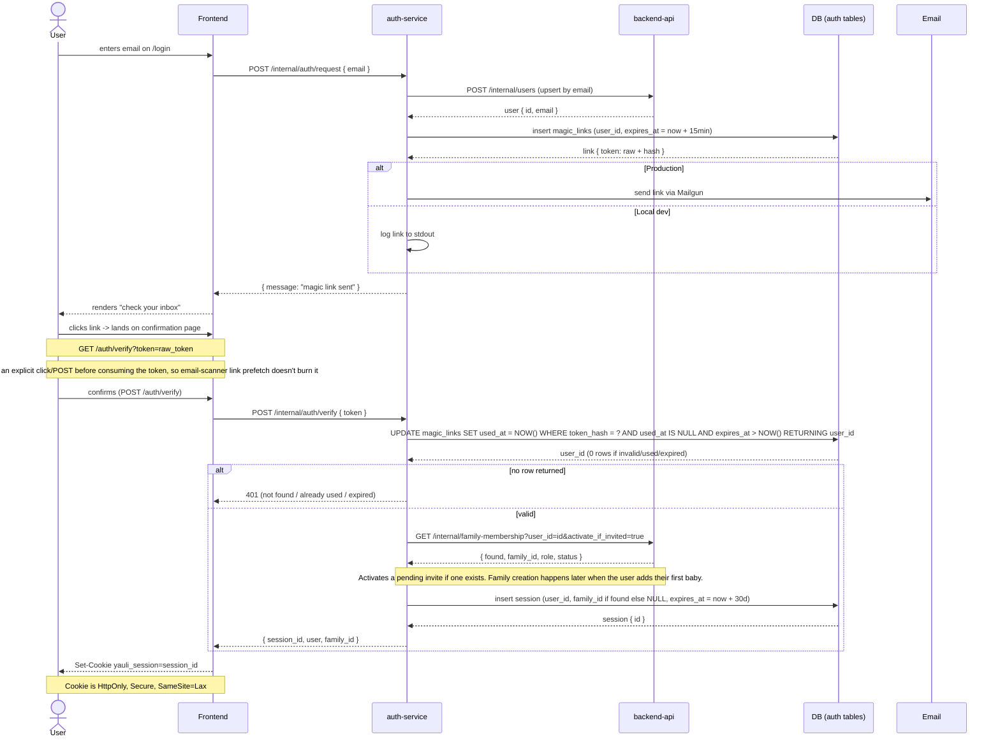
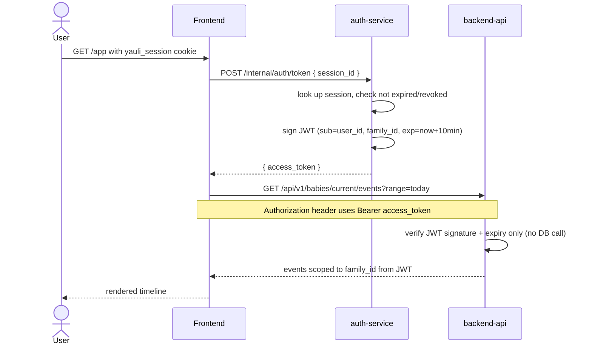
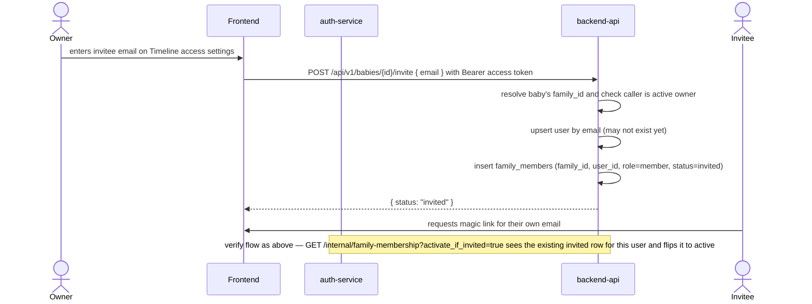
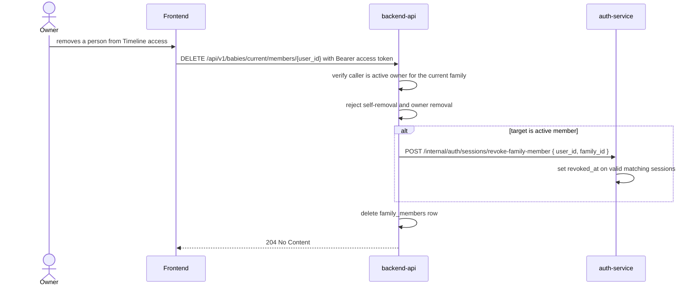

# Magic Link Auth (Design)

Status: **implemented for magic-link sign in and invite/session flows**. This
documents the production-grade auth shape that fits Yauli's service split; OAuth
2.1 + PKCE remains planned for the future MCP/ChatGPT surface. See
[AGENTS.md](../AGENTS.md) for the service architecture this builds on.

## Why this differs from a single-app magic link

A simpler reference design (one API, JWT-in-cookie, no session store) works
well for a small single-service app. Yauli's architecture is committed to
more than that:

* A dedicated **auth-service**, separate from backend-api and frontend, per
  AGENTS.md's service split — frontend and mcp-server are thin clients and
  never own auth logic.
* A schema with both a `sessions` table *and*
  `oauth_access_tokens` / `oauth_refresh_tokens` — i.e. two front doors
  (human login via magic link, machine login via ChatGPT's OAuth 2.1 + PKCE)
  that should converge on one token model inside auth-service.
* A real user/family model. `users`, `families`, and `family_members` live
  under backend-api's business domain, while auth-service treats their IDs as
  opaque references.

## Decisions made

| Question | Decision |
|---|---|
| Where does auth logic live? | `auth-service` owns **only** magic links, sessions, and (later) OAuth tokens. |
| Who owns users/families? | **backend-api**, per AGENTS.md's existing split (`users`/`families`/`family_members` are Core entities under backend-api's business domain; `magic_links`/`sessions`/`oauth_*` are Authentication entities under auth-service). auth-service never queries those tables directly — it calls backend-api's internal API to upsert a user by email, create a family, or resolve family membership. |
| Session model | Hybrid: opaque, DB-backed, revocable **session** (long-lived) mints short-lived, signed **JWT access tokens** on demand. Browser cookie holds only the session ID, never a JWT. |
| First-slice scope | Multi-family ready: signup, family creation, and inviting other members are in scope now, not deferred. |
| Long-term network exposure | auth-service stays fully private, including after OAuth 2.1 lands (see updated Network exposure note below). |

### Ownership boundary: auth-service is a credential/token service, not a user-data service

Earlier drafts of the flows below had auth-service reading and writing
`users`/`families`/`family_members` directly. That violates AGENTS.md's
"Single Source of Truth" (only backend-api owns business rules and
validation) and its explicit "no baby domain logic" scope for auth-service.
Corrected split:

* **auth-service** owns: `magic_links`, `sessions` (later `oauth_*`). It
  knows a `user_id` and a `family_id` only as opaque foreign keys it was
  handed by backend-api — it has no opinion about what a family *is*.
* **backend-api** owns: `users`, `families`, `family_members`, and the rules
  around them (e.g. "a family with no owner needs one," "an invited member
  becomes active on first login"). auth-service calls backend-api's internal
  API for all of this.

This introduces a real consequence: backend-api and auth-service have two
distinct trust tiers:

* **Internal routes** (`/internal/users`, `/internal/auth/...`, ...) —
  trusted callers only, over the private network. backend-api's internal API
  is called by auth-service with `INTERNAL_AUTH_SECRET`; auth-service's
  internal auth API is called by frontend and backend-api with
  `FRONTEND_AUTH_SECRET`.
* **User-facing routes** (`/api/v1/babies/current/...`) — gated by the JWT
  access token minted by auth-service, checked by backend-api itself
  (signature + expiry, no DB call).

**Concrete contract for shared secrets** — deliberately the simplest thing
that works at this scale, not left as a hand-wave:

* They are single static random values (e.g. 32 bytes, base64-encoded),
  set once as environment variables with the **same value on the services**
  that need to agree on them. No per-request negotiation, no key rotation
  infra, no asymmetric keys — those solve problems (multi-party trust,
  automated rotation) this small app doesn't have yet.
* `INTERNAL_AUTH_SECRET` is sent as a header (e.g. `X-Internal-Secret`) on
  every auth-service → backend-api internal call; backend-api's middleware
  compares it with `crypto/subtle.ConstantTimeCompare`, not `==`, so the
  comparison itself doesn't leak timing information.
* `FRONTEND_AUTH_SECRET` is sent as the same header on trusted calls into
  auth-service's `/internal/auth/*` routes. Despite the historical name, it
  is now shared by frontend and backend-api: frontend uses it for login/token
  operations, and backend-api uses it to ask auth-service to revoke sessions
  after removing active timeline access.
* `JWT_SIGNING_SECRET` is HMAC-SHA256, used by auth-service to sign and by
  backend-api to verify — symmetric because both are our own services and
  fully trust each other; no third party ever needs to verify these tokens
  independently in this slice.
* Rotation is manual: update the env var on both services and redeploy.
  Fine for this scale; revisit only if a real incident or a genuine
  multi-operator requirement makes manual rotation impractical.

### Why the hybrid session/access-token split

Two call patterns need different properties:

* **Browser → frontend** (is this user still logged in?) — low volume, wants
  instant revocation (logout, suspected leak).
* **frontend → backend-api**, and later **mcp-server → backend-api** (which
  user/family is this request for?) — high volume (every event write/read),
  wants cheap verification with no DB roundtrip per call.

A session is revocable but expensive to check on every call; a bare JWT is
cheap to check but can't be killed early. Splitting them gets both: kill a
session and no new access tokens can be minted from it, while already-issued
access tokens are short-lived enough that the exposure window is minutes, not
weeks. This is the same shape OAuth 2.1 already uses (refresh token ≈
session, access token ≈ JWT), so when ChatGPT/mcp-server auth lands later it
mints the *same* JWT format from an OAuth refresh token instead of a
magic-link session — backend-api's verification logic doesn't change
depending on which front door the user came through.

## Flow: request + verify magic link, first login

The `UPDATE ... RETURNING` is one atomic statement so a token can never be
consumed twice by concurrent requests (real click + a security scanner's
prefetch, or a double-tap). `token_hash` is a SHA-256 of the raw token —
only the hash is stored, so a DB dump can't be replayed as a live link.

## Flow: subsequent authenticated request

Frontend mints a fresh access token from auth-service **on every request**
rather than caching it. This was originally planned as a server-side,
per-session in-memory cache to save a round-trip — deliberately dropped:

* It buys nothing on restart-safety — the durable login state is the
  `sessions` row in auth-service's Postgres and the `yauli_session` cookie
  in the browser, neither of which a frontend restart touches. A cache
  would only have saved an internal HTTP call, at the cost of frontend no
  longer being fully stateless.
* On more than one frontend instance, a per-instance cache doesn't cause
  incorrect auth (minting is idempotent, not consuming, unlike the magic
  link), but it does mean instances mint independently — a minor
  inefficiency, not a correctness problem, but not worth the complexity
  either.
* Minting is cheap (one internal call, no DB write), so paying it per
  request is the simpler choice — consistent with not designing for a
  multi-instance scale this app isn't at yet. Revisit only if this
  round-trip is ever measured to actually matter.

## Flow: inviting someone to help with a baby

## Flow: removing timeline access

backend-api owns the membership decision. auth-service only revokes sessions
for the opaque `user_id`/`family_id` pair it is given. Already-issued
short-lived JWT access tokens may remain valid until expiry, but the removed
member can no longer mint fresh access tokens from revoked sessions.

## Schema (new)

Owned by **backend-api** (Core entities — business domain):

| Table | Purpose |
|---|---|
| `users` | `id`, `email` (unique), `created_at`. No password — magic link is the only credential. |
| `families` | `id`, `name`, `created_at`. |
| `family_members` | `family_id`, `user_id`, `role` (`owner`/`member`), `status` (`invited`/`active`), optional `relationship`, `created_at`. Join table; replaces the hardcoded `FamilyID`. |

Owned by **auth-service** (Authentication entities — credentials/tokens only):

| Table | Purpose |
|---|---|
| `magic_links` | `id`, `user_id`, `token_hash` (SHA-256 of the raw token, unique), `expires_at`, `used_at`. Raw token only ever exists in the emailed URL, never stored. |
| `sessions` | `id`, `user_id`, `family_id`, `expires_at`, `revoked_at`. Family is fixed per session — switching family (multi-family users) means minting a new session. |

auth-service holds `user_id`/`family_id` only as opaque foreign keys handed
back by backend-api's internal API — it never joins against or validates
those IDs' meaning itself.

`oauth_clients`, `oauth_authorization_codes`, `oauth_access_tokens`,
`oauth_refresh_tokens` (already in AGENTS.md's DB section) are **not** part
of this slice — they belong to the later ChatGPT/mcp-server OAuth 2.1 work,
which will reuse the same JWT access-token minting/verification path.

## Key properties

| Property | Value |
|---|---|
| Magic link TTL | 15 minutes |
| Magic link reuse | Not allowed — marked used on first click |
| Session TTL | 30 days |
| Session storage | DB (`sessions` table), opaque ID only in the cookie |
| Access token (JWT) TTL | 10 minutes, minted fresh on every request (no caching — see rationale above) |
| Access token storage | Nowhere — never cached, never sent to the browser, held only for the lifetime of a single request |
| Cookie content | Opaque session ID (not a JWT) |
| Cookie flags | `HttpOnly`, `Secure` in production, `SameSite=Lax` |
| JWT signing | HMAC-SHA256, static shared `JWT_SIGNING_SECRET` env var on both auth-service and backend-api (see "Concrete contract" above) |
| Internal-route auth | Static shared secret in `X-Internal-Secret`, checked with `crypto/subtle.ConstantTimeCompare`; `INTERNAL_AUTH_SECRET` gates auth-service → backend-api, `FRONTEND_AUTH_SECRET` gates frontend/backend-api → auth-service |
| Revocation | Instant at the session level (logout, active timeline access removal, later "sign out everywhere"); already-minted JWTs remain valid until their short expiry |

## Network exposure note

AGENTS.md marks auth-service as private/internal-only, same as backend-api.
That holds for the current magic-link flow: the browser only ever talks
to frontend; frontend calls auth-service and backend-api server-to-server.

**Resolved for the long term, not just this slice:** auth-service stays
fully private even after ChatGPT's OAuth 2.1 flow lands. That flow needs a
publicly reachable `/authorize`, `/token`, and discovery document — but
instead of giving auth-service its own public listener (which would break
AGENTS.md's "frontend/mcp-server public, backend-api/auth-service private"
split), **mcp-server** (already planned to be public) reverse-proxies those
specific OAuth paths to auth-service over the private network. From
ChatGPT's perspective the issuer is mcp-server's public hostname; auth-service
itself never needs a public domain. This is the same pattern frontend
already uses for the magic-link click (public front door absorbs the
external touchpoint, delegates the actual logic privately) — no new pattern
to invent when OAuth work starts, just apply it to mcp-server too.

## Hardening notes

Things a naive magic-link implementation gets wrong in production, designed
around from the start rather than patched in later:

* **Link prefetching**: corporate/consumer email security (Outlook Safe
  Links, some spam filters) auto-GETs links in emails to scan them before a
  human clicks. The emailed link lands on a confirmation page that requires
  an explicit action (button/POST) before the token is consumed — never
  redeem on a bare followed `GET`.
* **Token exposure in the URL**: the raw token necessarily appears in the
  emailed link's query string (`GET /auth/verify?token=...`), which is a
  real, if bounded, exposure surface — proxy/access logs and browser
  history could retain it. The blast radius is already limited (single-use,
  15-minute TTL, so a retained copy is only dangerous inside that narrow
  window), but two cheap mitigations are worth doing rather than assuming
  the TTL alone covers it: (1) the request logger must not log the query
  string for this specific route (redact it, don't rely on default
  logging), and (2) the confirmation page strips the token from the visible
  URL via `history.replaceState` as soon as it loads, so it doesn't linger
  in browser history past the moment it's read. This is deliberately *not*
  a full redesign to a typed one-time-code flow — that trades away the
  "click a link" UX a magic link is supposed to have, for a narrow,
  short-window risk that's already mostly closed by single-use + short TTL.
* **Hashed magic-link tokens at rest**: `magic_links.token_hash` is a SHA-256
  hash; the raw value exists only in the emailed URL. A DB dump can't be
  replayed as a live magic link.
* **Atomic single-use**: consuming a magic link is one
  `UPDATE ... WHERE used_at IS NULL AND expires_at > NOW() RETURNING ...`,
  not a SELECT then UPDATE — closes the race between a real click and a
  prefetch (or a double-tap) both seeing the token as valid.
* **DB clock, not app clock**: expiry is checked in the SQL `WHERE` against
  Postgres's `NOW()`, not fetched-then-compared against Go's `time.Now()` —
  avoids drift between auth-service's clock and the DB's.
* **No enumeration**: `POST /internal/auth/request` returns the same
  response whether or not the email already has an account.
* **Audit logging**: login, logout, and session-revocation events are
  written to `audit_logs` (already scoped in AGENTS.md's DB section) from
  the start, not bolted on later.
* **CSRF**: the browser session is a cookie, not a bearer token attached by
  JS, so state-changing POSTs (login submission, invite, logout) need either
  a CSRF token in the form or a deliberate decision to rely on
  `SameSite=Lax` — call this out explicitly rather than assuming the cookie
  flag alone is sufficient.

## Local dev

Local dev keeps the reference pattern: magic links are logged to
auth-service's stdout instead of being emailed. `docker compose logs
auth-service` after requesting a link, then click it directly from the
terminal output.

Production sends magic links through Mailgun's Messages API. Set
`ENV=production`, `MAILGUN_API_KEY`, `MAILGUN_DOMAIN`, and `MAILGUN_FROM`;
`MAILGUN_BASE_URL` is optional and defaults to `https://api.mailgun.net`.

## Explicitly out of scope for this slice

* OAuth 2.1 + PKCE for ChatGPT / mcp-server.
* Google / Apple sign-in.
* Transferring ownership or deleting a family.
* Rate limiting on `/auth/request` (needed before this is public-facing for
  real, but not blocking for Cip & Jenny using it first).
