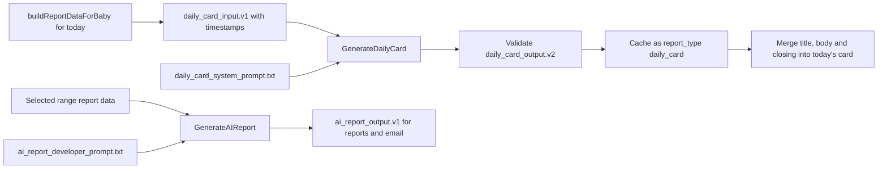

# Dedicated AI Daily Report Card

## Context

The deterministic daily report is accurate but reads like a statistics dump.
Parents need the feed and sleep facts within seconds, plus concise copy that
feels warm and acknowledges the work of keeping the timeline current.

Yauli already has a generic `GenerateAIReport` workflow for selected ranges
and scheduled email. Adding UI card fields to that output mixed two different
products, prompts, validation rules, cache identities, and release cadences.
It also forced weekly reports to carry an empty daily-card object.

Putting every word under model control would weaken factual guarantees and
would make the timeline depend on provider latency. Rendering model Markdown
or HTML would add unnecessary presentation and security complexity.

## Decision

Backend API continues to own and format the feed metrics, sleep metrics, and a
complete deterministic card fallback, including a fallback title.

Today's UI card uses a dedicated generation workflow:

* `buildReportDataForBaby` is called with no dates, which selects today in the
  baby's timezone;
* its complete JSON response, including current range and event timestamps, is
  wrapped in `daily_card_input.v1` with locale and viewer relationship;
* `GenerateDailyCard(context.Context, json.RawMessage)` sends that JSON with
  the separate `daily_card_system_prompt.txt` system prompt;
* the model returns strict `daily_card_output.v2` JSON containing a short
  `title`, one cohesive `body`, and a brief `closing` only;
* backend application validation runs before generated content is cached or
  returned;
* the frontend replaces the fallback title, body, and closing while keeping
  deterministic feed and sleep metrics unchanged.

The generic `GenerateAIReport` workflow remains on `ai_report_output.v1` and
continues serving range reports and scheduled email. It does not know about
the daily-card contract or prompt. Both generation methods use the same
concrete `internal/aiclient` HTTP transport and the same regenerable cache
table, but use separate handler workflows, prompt versions, schema versions,
validation, and cache `report_type` values.

The semantic daily-card hash removes assembly timestamps and stabilises the
moving current-day range cutoff, while retaining event timestamps because
event timing is meaningful input. A current-day cache entry is fresh for two
hours. This allows the model to reconsider how far the day has progressed even
when no new event has been recorded, without putting the wall clock directly
into the semantic hash.

The web app renders deterministic content immediately. An HTMX request loads
AI copy only when Today is selected. Yesterday and earlier timeline days keep
the deterministic card without AI interpretation. Any timeout, provider
failure, refusal, invalid output, or stale cache with generation unavailable
leaves the deterministic fallback visible.

The semantic cache identity includes the current viewer relationship. No
other family-member profile data is sent to the model. The frontend escapes
all generated strings and applies bold emphasis only to deterministic primary
metrics.

## Alternatives Considered

Extend `ai_report_output` with a `daily_card` field. This was rejected because
the UI card and generic range report have different purposes and safety rules.
It would also couple scheduled email to a UI-only contract.

Generate the whole card as Markdown. This was rejected because the model could
alter factual KPI values, raw Markdown would require another rendering and
sanitisation path, and formatting could vary between generations.

Generate synchronously during the normal daily report request. This was
rejected because model latency or availability would delay the timeline and
event mutation responses.

Generate AI interpretation for every historical timeline day. This was
deferred because historical views primarily need fast, exact records. The
first version uses AI only for the living current-day story.

Use only rotating deterministic templates. This would be reliable, but it
would not provide the requested variation or data-grounded observation layer.

Create a second provider client or cache table. This was rejected because the
existing concrete OpenAI transport and regenerable cache storage can support
both workflows without sharing their product contracts.

## Consequences

The daily report stays accurate and available without OpenAI. Unchanged data
and relationship context reuse cached prose until the current-day freshness
window expires. Changed events, including changed event timestamps, create a
new semantic input hash. Different viewers receive separate personalised
closings.

The API adds a today-only `POST /reports/daily-card/ai` endpoint and keeps the
existing generic `POST /reports/ai` contract unchanged. The deterministic
`GET /reports/daily` contract remains the source for fallback content and KPI
rendering.

The system prompt and application validator form a product contract. Changes
to tone, factual boundaries, punctuation, emoji use, growth coverage, or
relationship handling require focused daily-card evals and prompt or schema
version review.
