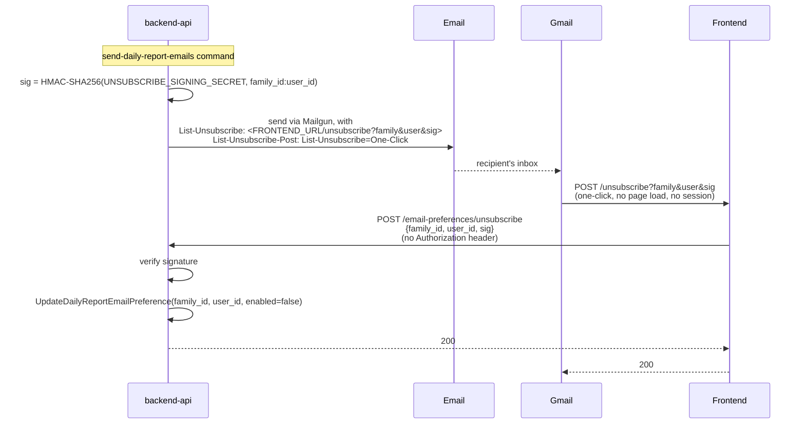

# Report Email One-Click Unsubscribe

Status: **implemented**. Adds RFC 8058 `List-Unsubscribe` /
`List-Unsubscribe-Post` headers to scheduled daily report emails, so Gmail
(and Yahoo/Outlook) show a native "Unsubscribe" link next to the sender name
that opts the recipient out with no click-through page and no login.

## Why

Two independent motivations:

* **Recipient friction**: today the only way to stop report emails is the
  in-app, owner-only Timeline access settings page — a helper who just wants
  the emails to stop has to ask the owner. A one-click unsubscribe removes
  that dependency for the one thing every recipient should always be able to
  control about their own inbox.
* **Deliverability**: mailbox providers increasingly require senders to
  support one-click unsubscribe (RFC 8058) or risk being marked as spam,
  independent of whether recipients ever use it.

## Architecture constraint: backend-api isn't public

Per [AGENTS.md](../AGENTS.md)'s service split, only **frontend** (served at
getyauli.com) is reachable from the public internet — backend-api and
auth-service are both private. Report emails are composed and sent from
backend-api (it owns report generation and delivery state), but the URL
Gmail actually calls has to resolve on the public frontend. This reuses the
same pattern [docs/auth-magic-link.md](auth-magic-link.md) already
establishes for the planned OAuth work: *a public front door absorbs the
external touchpoint and delegates the actual logic privately* — here,
frontend's `/unsubscribe` route is a thin, unauthenticated pass-through to a
backend-api endpoint that does the real work.

## Token scheme: stateless, HMAC-signed, no expiry

Unlike magic-link tokens (single-use, DB-backed, 15-minute TTL — see
auth-magic-link.md), unsubscribe links must keep working indefinitely: mail
clients cache and re-render old emails, and a functioning unsubscribe link is
a compliance expectation, not just a UX nicety. So this uses a different
shape on purpose:

* No database row, no expiry, no consumption state.
* backend-api signs `family_id:user_id` with `UNSUBSCRIBE_SIGNING_SECRET`
  (HMAC-SHA256) when building the report email. The link carries the family
  ID, user ID, and signature as plain query params —
  `{FRONTEND_URL}/unsubscribe?family=...&user=...&sig=...`.
  (`backend-api/internal/handlers/unsubscribe.go`: `signUnsubscribeToken`,
  `verifyUnsubscribeToken`, `unsubscribeURL`.)
* The signature is the *entire* trust boundary for the endpoint that
  consumes it — there's no user session on this path (Gmail's mail servers
  make the request, not a logged-in browser), so a valid signature is both
  necessary and sufficient.
* `UNSUBSCRIBE_SIGNING_SECRET` is a new, dedicated static secret — not
  shared with `JWT_SIGNING_SECRET` or `INTERNAL_AUTH_SECRET` — so a leak of
  one doesn't compromise the other trust domains.

The flag this flips already existed before this feature:
`family_members.daily_report_email_enabled` (migration
`0010_daily_report_email_preference.sql`), the same one
`ListDueDailyReportEmailJobs` checks and the in-app settings page's
`UpdateTimelineMemberReportPreferences` already updates. No new table or
migration was needed.

## Flow

A manual `GET` on the same frontend URL (someone clicking a rendered link
rather than Gmail's one-click button) follows the identical verify-and-flip
path and gets a small static confirmation page instead of a bare `200`.

## Endpoints

| Method/Path | Service | Auth | Purpose |
|---|---|---|---|
| `GET`/`POST /unsubscribe` | frontend | none (public) | Parses `family`/`user`/`sig` query params, calls backend-api, relays the result. `backendclient.Unsubscribe` (`frontend/internal/backendclient/http.go`). |
| `POST /email-preferences/unsubscribe` | backend-api | none — gated by its own signature check, not session/JWT/internal-secret | Verifies the HMAC signature, then calls `FamilyStore.UpdateDailyReportEmailPreference(..., enabled=false)`. Registered directly on the root router in `runHTTPServer()`, outside every authenticated route group. Missing/tampered signature → `400`; already-inactive membership → `200` (idempotent from the recipient's point of view). |

## Config

New env vars, both on **backend-api** only (frontend needs nothing new — it
already has `BACKEND_API_URL`):

| Var | Purpose |
|---|---|
| `FRONTEND_URL` | Public frontend base URL (e.g. `https://getyauli.com`), used to build the link embedded in the email. Mirrors auth-service's identically-named, identically-purposed env var. Local dev: `http://localhost:${FRONTEND_PORT}` (see `docker-compose.yml`). |
| `UNSUBSCRIBE_SIGNING_SECRET` | Signs and verifies unsubscribe links. A single static value, same pattern as `JWT_SIGNING_SECRET`/`INTERNAL_AUTH_SECRET` (see auth-magic-link.md's "Concrete contract for shared secrets") — but its own value, not reused from either. |

Both are optional at the code level: if either is empty, `unsubscribeURL`
returns `""` and the email is simply sent without the `List-Unsubscribe`
headers, rather than failing to send.

## Explicitly out of scope

* Per-report-type opt-out (only `daily` reports exist today; the flag this
  reuses is already per-recipient-per-family, not per-report-type).
* A resubscribe flow — turning report emails back on goes through the
  existing in-app owner settings, same as today.
* Rate limiting on `/unsubscribe` — low-value target for abuse (worst case
  is flipping a boolean an unauthorized party already can't read/observe
  without knowing the family/user IDs *and* a valid signature).
